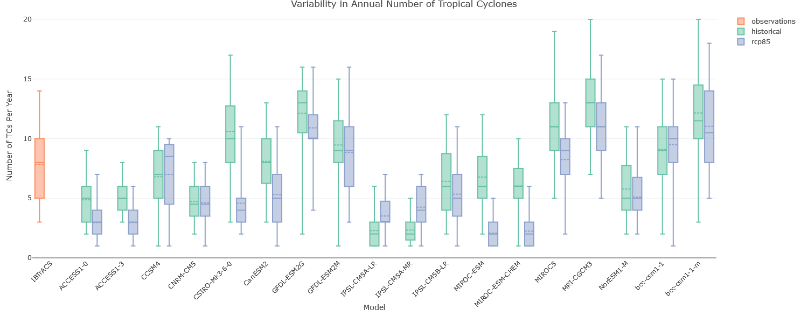
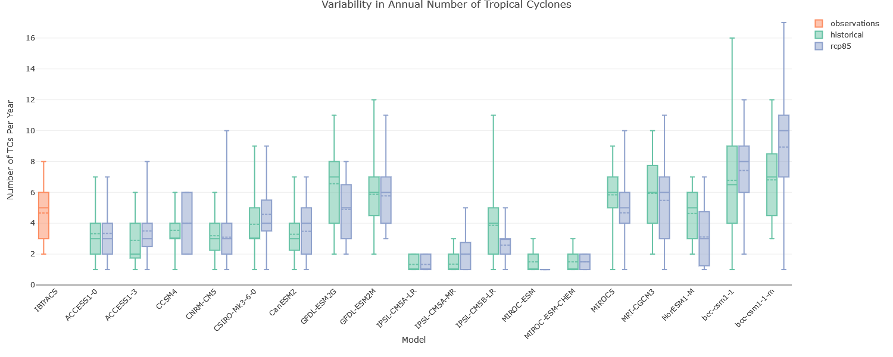
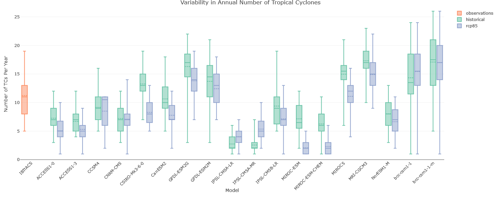
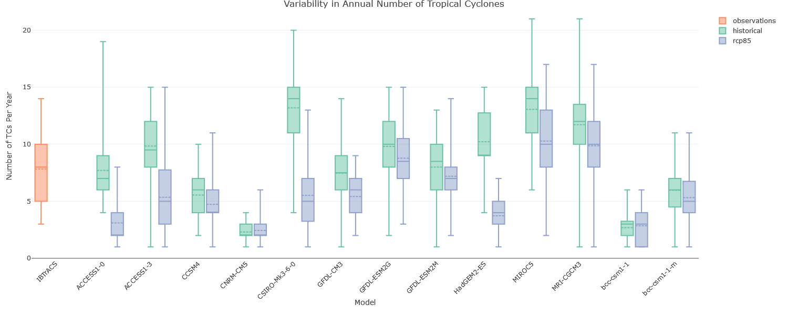
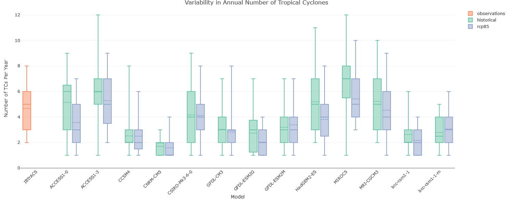
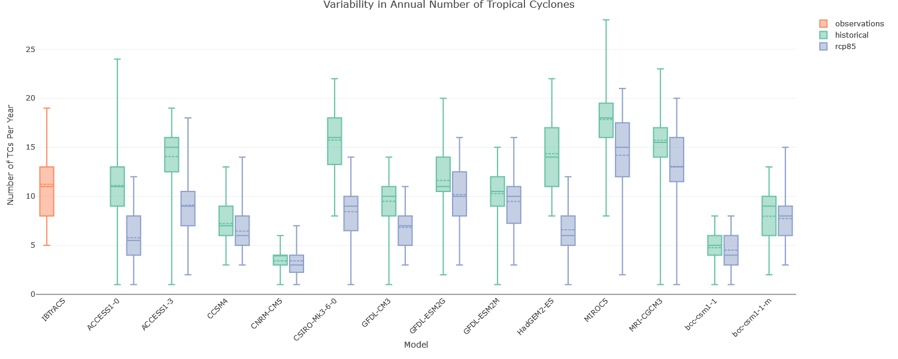
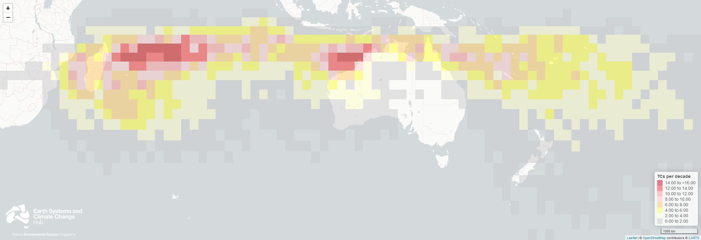
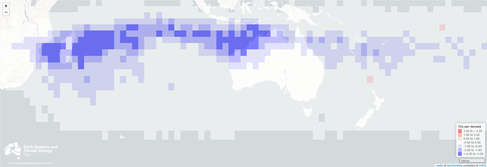
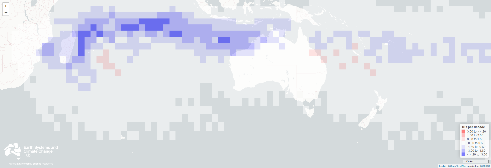

# hazards-TC

Material from analysis of TC hazards for ACS/NCRA

## Material produced for NCRA

Tropical cyclone projection information were provided in two formats for each of two detection methods, CSIRO Direct Detection (CDD) and Okubo-Weiss-Zeta parameter (OWZ):

- Annual frequency of modelled tropical cyclones in historical (1970-2000) and future (2070-2100) climate periods
  - CSV files were also created corresponding to the statistical values from the annual frequency boxplots
- Projected change in spatial frequency of tropical cyclone occurrence (future minus historical)

## Key messages:
- All TC detections analysed here are from CMIP5 global climate models (GCM). The period analysed from the historical scenario of GCM outputs was 1970-2000, with a high-emissions future scenario RCP 8.5 used for 2070-2100.
- There are large differences in the numbers of tropical cyclones detected in different GCM simulations.
- Different detection methods can produce differing projected changes in tropical cyclone frequency. The use of multiple methods of tropical cyclone detection is seen as essential to help assess the uncertainty around the risk of their occurrence.
- There are large differences in the spatial changes produced between GCMs. Combining the detections from multiple GCMs into ensembles of models allows us to produce more realistic historical densities of tropical cyclones and spatially coherent projected changes in frequency. The ensemble approach also reduces the uncertainty associated with projections from a single GCM. 

## Annual frequency in CMIP5 GCMs

- These figures show the distribution of annual counts of tropical cyclones in the west Australia (90°-135°E), east Australia (135°-160°E) and the Australia (90°-160°E) domains for the “historical” period 1970-2000 and the “future” period 2070-2100.
- For the period plotted over the specified domain, the statistical elements of each box-and-whisker plot are (from top to bottom):
  - Largest annual total,
  - Quartile 3 (75th percentile),
  -   Median (solid line) and Mean (dashed line),
  -   Quartile 1 (25th percentile), and
  -   Lowest annual total
- These statistics have also been made available for each model and detection method in separate CSV files.
- There is a large variation in the number of tropical cyclones detected in the various CMIP5 GCMs examined. Some models produce more than are observed in the IBTrACS best track data, however more often they produce too few; some produce so few (less than half the observed average) that they are excluded from the model ensembles used for further analysis.
- Most GCMs project decreases in tropical cyclone frequency by the late 21st century, but some GCMs project increases in frequency.
- Although the lines of evidence mainly point to decreases, there remains uncertainty around the magnitude (and in some places, the sign) of changes in tropical cyclone frequency around Australia.

### CDD 

*Western Australia (90°-135°E):*

*Eastern Australia (135°-160°E):*

*Australia (90°-160°E):*

**_Caption:_** *Variability in annual count of tropical cyclones in the Australian region using the CDD method. Top row, Australia West (90°-135°E); middle row Australia East (135°-160°E); bottom row Australia domain (90°-135°E)*

### OWZ

*Western Australia (90°-135°E):*

*Eastern Australia (135°-160°E):*

*Australia (90°-160°E):*

**_Caption:_** *Variability in annual count of tropical cyclones in the Australian region using the OWZ method. Top row, Australia West (90°-135°E); middle row Australia East (135°-160°E); bottom row Australia domain (90°-160°E)*

## Spatial frequency change

- Spatial patterns of tropical cyclone frequency of occurrence (number of storms per decade) are displayed here as a density field on a 2.5° longitude-latitude grid.
  - The first image shows the density of tropical cyclones in the IBTrACS best track data set for the period 1981-2010. 
  - The following two images show the projected change in gridded frequency of occurrence in number of storms per decade. The track density for the "historical" period (1970-2000) is subtracted from that of the "future" period (2070-2100) to display the projected change.
- Individual models display large variations in their spatial representation of tropical cyclones (not shown). Combining the density of tropical cyclone frequency from multiple GCMs into a multi-model ensemble helps to form a more spatially coherent evaluation of tropical cyclone risk throughout the domain.
- The two tropical cyclone detection methods used here – CDD and OWZ – produce differing spatial frequencies and thus patterns of future change.
- When using tropical cyclone tracks detected within a common set of GCMs:
  - Both detection methods display large decreases in frequency in the Indian Ocean including off NW Australia, though larger decreases are seen using the CDD method.
  - Projected changes in frequency for the region off eastern Australia are less clear with changes derived from the CDD method showing consistent decreases, while results using the OWZ method have some isolated areas of increases amongst large areas of decrease or little change.
- Overall, the OWZ method produces a smaller reduction in tropical cyclone frequency than using the CDD method.
- Given the relatively poor resolution of GCMs and their inability to accurately simulate many features of tropical cyclones (e.g. their wind speeds and central pressures are usually much less intense than in reality), there remain large areas of uncertainty around future tropical cyclone behaviour, both for the Australian region and globally.

### Best Track Observations of Tropical Cyclones (IBTrACS)

**_Caption:_** *Observed spatial frequency (on a 2.5° longitude-latitude grid) of tropical cyclones from the IBTrACS best track data set for the period 1981-2010.*

### CDD

**_Caption:_** *Change in spatial frequency (on a 2.5° longitude-latitude grid) of tropical cyclones detected using the CDD method by late 21st century (2070-2100, RCP 8.5). Projections are derived from a subset ensemble of 9 GCMs that were also analysed using another detection method (OWZ) to enable cross-method comparison of projections.*

### OWZ

**_Caption:_** *Change in spatial frequency (on a 2.5° longitude-latitude grid) of tropical cyclones detected using the OWZ method by late 21st century (2070-2100, RCP 8.5). Projections are derived from a subset ensemble of 9 GCMs that were also analysed using another detection method (CDD) to enable cross-method comparison of projections.*

## Contributors / Authors / Acknowledgements

Hazard team:  

- Hamish Ramsay (CSIRO Environment, lead)
- Craig Arthur (Geoscience Australia, alternate lead)
- Tony Rafter (CSIRO Environment, contributor)
- Stacey Osbrough (CSIRO Environment, contributor)

